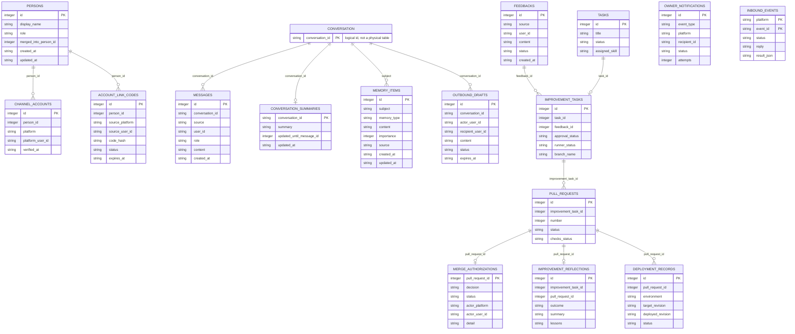

# gugabobo

`gugabobo` is a cloud-first autonomous agent prototype with one persistent core, shared persona and memory, QQ and Telegram adapters, a management Dashboard, and a human-approved GitHub self-improvement flow.

## Implemented scope

- CLI entrypoint
- Core agent with shared persona
- SQLite memory and feedback store
- FastAPI health/status API
- Long-running daemon loop
- QQ via NapCat and Telegram via webhook or polling
- Token-budgeted context, rolling summaries, and explicit long-term memory
- Dashboard administration and diagnostics
- Isolated Claude Code changes with CI-gated pull requests
- Automated tests and GitHub Actions CI

## Quick start

```bash
python -m venv .venv
.\.venv\Scripts\Activate.ps1
pip install -e ".[dev]"
gugabobo status
gugabobo chat "你好"
gugabobo feedback add "回复太长"
gugabobo feedback resolve 1
gugabobo messages list
gugabobo config show
gugabobo db path
gugabobo improve create 1 --scope chat --risk low
gugabobo improve approve 1
gugabobo improve pr 1
gugabobo tasks list
gugabobo pr list
gugabobo api
```

Open the local monitoring dashboard:

```text
http://127.0.0.1:8765/dashboard
```

After entering `GUGABOBO_ADMIN_TOKEN`, the Dashboard can manage runtime processes, diagnostics, non-secret configuration, conversation context, memories, summaries, feedback, access rules, tasks, improvement runs, pull requests, and outbound drafts. High-risk actions require a fixed confirmation phrase and are written to the audit log. `blocked` QQ and Telegram users are rejected before reaching the core agent.

Access roles are enforced before write operations from QQ and Telegram. `user` can chat only, `trusted` can also record feedback and explicit long-term memories, `owner` is reserved for administrative and future high-risk operations, and `blocked` is ignored.

Windows launchers:

```text
scripts\start-gugabobo.bat
scripts\stop-gugabobo.bat
scripts\restart-gugabobo.bat
```

## NapCat / OneBot v11

P1 starts with a OneBot v11 HTTP webhook for NapCat.

Run gugabobo:

```bash
gugabobo api
```

Configure NapCat event reporting to:

```text
http://127.0.0.1:8765/onebot/v11/events
```

If you want gugabobo to send replies back through NapCat, enable NapCat's HTTP server and set:

```env
GUGABOBO_NAPCAT_API_URL=http://127.0.0.1:3000
GUGABOBO_NAPCAT_REPLY_ENABLED=true
GUGABOBO_NAPCAT_ACCESS_TOKEN=
```

Group chats only reply when the bot is mentioned or the message starts with a configured wake word.

An owner request to message another QQ user creates a ten-minute draft. NapCat sends it only after the same user confirms `确认发送 #<id>` in the same conversation. Duplicate confirmations do not send twice.

## Telegram Bot

Telegram uses the same `CoreAgent`, persona, memory store, LLM provider, dashboard, and permission model as QQ.

Local webhook endpoint:

```text
http://127.0.0.1:8765/telegram/events
```

Configuration:

```env
GUGABOBO_OWNER_TELEGRAM_IDS=
GUGABOBO_TELEGRAM_BOT_TOKEN=
GUGABOBO_TELEGRAM_BOT_USERNAME=
GUGABOBO_TELEGRAM_WEBHOOK_SECRET=
GUGABOBO_TELEGRAM_REPLY_ENABLED=false
GUGABOBO_TELEGRAM_GROUP_WAKE_WORDS=gugabobo,咕嘎BoBo
GUGABOBO_TELEGRAM_PROXY=
```

Current behavior:

- private chats reply directly
- group chats reply only when mentioned or explicitly awakened
- unlinked users and every group keep separate conversation context
- verified QQ and Telegram accounts belonging to one person share private context
- risky owner-only operations require explicit owner confirmation
- Telegram-specific code stays in the adapter layer, not in the core agent

### Link QQ and Telegram accounts

Account linking requires proof of control over both private chats. In either QQ or Telegram
private chat, send:

```text
绑定账号
```

gugabobo returns a single-use code valid for ten minutes. In the other platform's private
chat, send:

```text
绑定账号 GB-XXXX-XXXX-XXXX
```

After verification, both channel accounts resolve to one `person_id` and use the same
`person:<person_id>:direct` conversation. Existing private messages, summaries, memories,
and the highest verified access role are preserved. Group conversations are never merged.

When `GUGABOBO_TELEGRAM_REPLY_ENABLED=false`, the endpoint processes the message and reports that a reply is available without calling Telegram's `sendMessage` API.

For local development without a public webhook URL, run polling after setting `GUGABOBO_TELEGRAM_BOT_TOKEN`:

```bash
gugabobo telegram poll --send
```

Without `--send`, polling processes updates but only reports that replies are available unless `GUGABOBO_TELEGRAM_REPLY_ENABLED=true`.

## LLM providers

`gugabobo` supports OpenAI-compatible providers. Set `GUGABOBO_LLM_PROVIDER` to choose one.

```env
GUGABOBO_LLM_PROVIDER=moonshot
GUGABOBO_MOONSHOT_API_KEY=
GUGABOBO_MOONSHOT_BASE_URL=https://api.moonshot.ai/v1
GUGABOBO_MOONSHOT_MODEL=kimi-k2.6
GUGABOBO_DEEPSEEK_API_KEY=
GUGABOBO_DEEPSEEK_BASE_URL=https://api.deepseek.com
GUGABOBO_DEEPSEEK_MODEL=deepseek-v4-flash
GUGABOBO_OPENAI_API_KEY=
GUGABOBO_OPENAI_BASE_URL=https://api.openai.com/v1
GUGABOBO_OPENAI_MODEL=gpt-5.6
GUGABOBO_LLM_TIMEOUT_SECONDS=60
GUGABOBO_LLM_CONTEXT_MESSAGES=400
GUGABOBO_LLM_MEMORY_ITEMS=12
GUGABOBO_LLM_HISTORY_TOKEN_BUDGET=24000
GUGABOBO_LLM_SUMMARY_TRIGGER_TOKENS=24000
GUGABOBO_LLM_SUMMARY_KEEP_RECENT_TOKENS=8000
```

If the API key is missing or the provider call fails, chat falls back to the local placeholder reply.

LLM context is scoped by conversation. Linked QQ and Telegram private accounts share one
person conversation; CLI/API users, unlinked people, and groups remain isolated.

Context inputs:

- recent raw messages from the same conversation
- optional conversation summary
- relevant long-term memory items for the same conversation and global memories
- a hard recent-message cap and a token budget, whichever is reached first

Current SQLite data model:



`CONVERSATION` is a logical entity derived from `conversation_id`; it is not a separate SQLite
table yet. The legacy private ids `qq:user:<id>` and `telegram:user:<id>` remain accepted as
query aliases and resolve to the linked person's canonical conversation.

Useful commands:

```bash
gugabobo memory add "用户喜欢蓝色" --subject qq:user:241398668 --memory-type preference --importance 8
gugabobo memory list --subject qq:user:241398668
gugabobo summary set qq:user:241398668 "用户正在测试 QQ Bot 上下文。"
gugabobo summary show qq:user:241398668
```

When a user explicitly says `记住...`, `请记住...`, `你要记住...`, `帮我记住...`, or `remember...`, gugabobo records the content as a long-term memory for the current conversation automatically.

## GitHub self-improvement (P4 foundation)

P4 starts the self-improvement loop foundation. Feedback can be turned into an
improvement task that, after owner approval, opens a pull request against the
repository. Authentication uses a Personal Access Token.

```env
GUGABOBO_GITHUB_TOKEN=
GUGABOBO_GITHUB_OWNER=GugaBoBo-s
GUGABOBO_GITHUB_REPO=gugabobo
GUGABOBO_GITHUB_API_URL=https://api.github.com
GUGABOBO_GIT_AUTHOR_NAME=GuGabobo
GUGABOBO_GIT_AUTHOR_EMAIL=263493647+GuGabobo@users.noreply.github.com
```

gugabobo has its own GitHub account, [GuGabobo](https://github.com/GuGabobo).
Sandbox self-improvement commits are authored as `GUGABOBO_GIT_AUTHOR_NAME` /
`GUGABOBO_GIT_AUTHOR_EMAIL`, defaulting to that account's GitHub noreply email so
commits link back to it. This is independent of the developer's local git
identity. On the server, set `GUGABOBO_GITHUB_TOKEN` to a token from the GuGabobo
account so pull requests are opened by the bot rather than the owner.

Flow:

```bash
gugabobo feedback add "希望回复更简洁"
gugabobo improve create 1 --scope chat --risk low
gugabobo improve approve 1
gugabobo improve run 1
gugabobo improve pr 1
gugabobo pr list
```

### Claude Code runner (P5 foundation)

gugabobo does not implement its own coding agent. Its code-editing ability comes
from calling Claude Code. `gugabobo improve run <id>` clones the repository into a
sandbox and runs Claude Code headless to edit the code, then collects the diff.

```env
GUGABOBO_SANDBOX_DIR=.gugabobo/sandbox
GUGABOBO_RUNNER_CONTAINER_RUNTIME=docker
GUGABOBO_RUNNER_CONTAINER_IMAGE=gugabobo-runner:local
GUGABOBO_RUNNER_HOME_DIR=.gugabobo/claude-home
GUGABOBO_CLAUDE_BIN=claude
GUGABOBO_CLAUDE_TIMEOUT_SECONDS=900
```

`improve run` produces the diff only. `improve ship` goes further: it gates the
diff on sandbox checks (`ruff` + `pytest`), then commits, pushes the branch, and
opens a real pull request.

```bash
gugabobo improve ship 1
```

Current behavior:

- the improvement task must be approved before it can run
- the sandbox is a no-hardlink Git clone under `GUGABOBO_SANDBOX_DIR`
- Claude Code runs in a resource-limited container with only the sandbox and a
  dedicated credential home mounted; host secrets and the Docker socket are absent
- `improve run` moves `runner_status` through `running` → `changes_ready` /
  `no_changes` / `failed`
- `improve ship` additionally runs `ruff` and `pytest` in a network-disabled
  container; if they
  fail, `runner_status` becomes `checks_failed` and no pull request is opened
- a passing `improve ship` pushes the branch and opens a pull request, sets
  `runner_status` to `pr_open`, and records it in `pull_requests`
- opening a pull request queues owner notifications for every configured QQ and
  Telegram owner
- there is no host execution fallback when Docker or the runner image is unavailable
- runs and pull requests are high-risk actions recorded in audit logs

`pr sync` refreshes a recorded pull request's state (open / merged / closed) and
CI checks (`checks_status`) from GitHub:

```bash
gugabobo pr sync 1
gugabobo pr approve-merge 15
gugabobo pr reject-merge 15
gugabobo pr sync-all
gugabobo deployment record-current
```

Current behavior:

- an improvement task must be approved before a pull request can be opened
- the pull request commits a proposal file `improvements/<id>.md`; it records
  intent only and does not modify source code yet
- opening a pull request is a high-risk action recorded in audit logs
- API write endpoints require `GUGABOBO_ADMIN_TOKEN`, and opening a pull request
  requires `confirm_text=OPEN`
- generated branches are unique and never merge without explicit authenticated
  owner approval
- an owner may send `同意合并 PR #15` or `/merge 15` in QQ or Telegram, or use
  Dashboard/CLI; one approval is sufficient across all channels
- approval is durable, but merge remains blocked until GitHub checks report
  `success`; `unknown`, `pending`, and `failure` never merge
- merge/rejection creates a reflection record, queues outcome notifications, and
  merged revisions receive a pending deployment record

API endpoints:

```text
GET  /tasks
GET  /tasks/{id}
GET  /improvements
POST /improvements
POST /improvements/{id}/approve
POST /improvements/{id}/reject
POST /improvements/{id}/run
POST /improvements/{id}/ship
POST /improvements/{id}/pull-request
GET  /prs
GET  /prs/{id}
POST /prs/{id}/sync
POST /prs/{id}/approve-merge
POST /prs/{id}/reject-merge
POST /prs/sync-all
GET  /merge-authorizations
GET  /improvement-reflections
GET  /deployments
GET  /owner-notifications
POST /deployments/record-current
```

## Configuration

Copy `.env.example` to `.env` when you need custom local settings.
