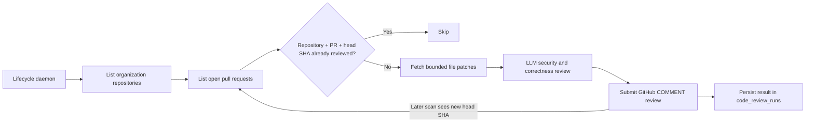
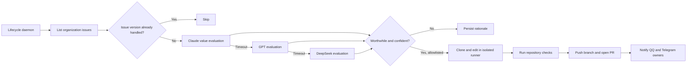

# gugabobo

`gugabobo` is a cloud-first autonomous agent prototype with one persistent core, shared persona and memory, QQ and Telegram adapters, a management Dashboard, and a human-approved GitHub self-improvement flow.

## Implemented scope

- CLI entrypoint
- Core agent with shared persona
- SQLite memory and feedback store
- FastAPI health/status API
- Long-running daemon loop
- QQ via NapCat and Telegram via webhook or polling
- Token-budgeted context, rolling summaries, and explicit long-term memory
- Pydantic AI orchestration over LiteLLM for chat, tools, structured output, and code analysis
- Optional Vexor semantic retrieval over conversation memories
- Owner-only encrypted LAN file transfer through Glitter
- Read-only remote skills from `FogMoe/agents`
- Read-only public X profiles for `@ScarletKc_` and `@woshigugabobo`
- Read-only Steam game search, store details, and current-player lookup
- Editable `soul.md` and `rules.md` prompt guidance with owner-only writes
- Dashboard administration and diagnostics
- Isolated code-runner changes with CI-gated pull requests
- Organization-wide automated GitHub pull request reviews
- Organization-wide issue discovery, value evaluation, and allowlisted autonomous PR creation
- Code-only model routing from Claude to GPT to DeepSeek on consecutive timeouts
- Automated tests and GitHub Actions CI

## Quick start

```bash
python -m venv .venv
.\.venv\Scripts\Activate.ps1
pip install -e ".[dev]"
gugabobo status
gugabobo chat "你好"
gugabobo feedback add "回复太长"
gugabobo feedback resolve 1
gugabobo messages list
gugabobo config show
gugabobo db path
gugabobo improve create 1 --scope chat --risk low
gugabobo improve approve 1
gugabobo improve pr 1
gugabobo tasks list
gugabobo pr list
gugabobo review scan
gugabobo review list
gugabobo issue scan
gugabobo issue list
gugabobo api
```

Open the local monitoring dashboard:

```text
http://127.0.0.1:8765/dashboard
```

After entering `GUGABOBO_ADMIN_TOKEN`, the Dashboard can manage runtime processes, diagnostics, non-secret configuration, conversation context, memories, summaries, feedback, access rules, tasks, improvement runs, pull requests, and outbound drafts. The token must be non-empty and must not use the `change-me` placeholder; otherwise every administrative write endpoint returns `503`. High-risk actions require a fixed confirmation phrase and are written to the audit log. `blocked` QQ and Telegram users are rejected before reaching the core agent.

Access roles are enforced before write operations from QQ and Telegram. `user` can chat only, `trusted` can also record feedback and explicit long-term memories, `owner` is reserved for administrative and future high-risk operations, and `blocked` is ignored.

Windows launchers:

```text
scripts\start-gugabobo.bat
scripts\stop-gugabobo.bat
scripts\restart-gugabobo.bat
```

## NapCat / OneBot v11

P1 starts with a OneBot v11 HTTP webhook for NapCat.

Run gugabobo:

```bash
gugabobo api
```

Configure NapCat event reporting to:

```text
http://127.0.0.1:8765/onebot/v11/events
```

If you want gugabobo to send replies back through NapCat, enable NapCat's HTTP server and set:

```env
GUGABOBO_NAPCAT_API_URL=http://127.0.0.1:3000
GUGABOBO_NAPCAT_REPLY_ENABLED=true
GUGABOBO_NAPCAT_ACCESS_TOKEN=
```

Group chats only reply when the bot is mentioned or the message starts with a configured wake word.

An owner request to message another QQ user creates a ten-minute draft. NapCat sends it only after the same user confirms `确认发送 #<id>` in the same conversation. Duplicate confirmations do not send twice.

## Telegram Bot

Telegram uses the same `CoreAgent`, persona, memory store, LLM provider, dashboard, and permission model as QQ.

Local webhook endpoint:

```text
http://127.0.0.1:8765/telegram/events
```

Configuration:

```env
GUGABOBO_OWNER_TELEGRAM_IDS=
GUGABOBO_TELEGRAM_BOT_TOKEN=
GUGABOBO_TELEGRAM_BOT_USERNAME=
GUGABOBO_TELEGRAM_WEBHOOK_SECRET=
GUGABOBO_TELEGRAM_REPLY_ENABLED=false
GUGABOBO_TELEGRAM_GROUP_WAKE_WORDS=gugabobo,咕嘎BoBo
GUGABOBO_TELEGRAM_PROXY=
```

Current behavior:

- private chats reply directly
- group chats reply only when mentioned or explicitly awakened
- unlinked users and every group keep separate conversation context
- verified QQ and Telegram accounts belonging to one person share private context
- risky owner-only operations require explicit owner confirmation
- Telegram-specific code stays in the adapter layer, not in the core agent

### Link QQ and Telegram accounts

Account linking requires proof of control over both private chats. In either QQ or Telegram
private chat, send:

```text
绑定账号
```

gugabobo returns a single-use code valid for ten minutes. In the other platform's private
chat, send:

```text
绑定账号 GB-XXXX-XXXX-XXXX
```

After verification, both channel accounts resolve to one `person_id` and use the same
`person:<person_id>:direct` conversation. Existing private messages, summaries, memories,
and the highest verified access role are preserved. Group conversations are never merged.

When `GUGABOBO_TELEGRAM_REPLY_ENABLED=false`, the endpoint processes the message and reports that a reply is available without calling Telegram's `sendMessage` API.

For local development without a public webhook URL, run polling after setting `GUGABOBO_TELEGRAM_BOT_TOKEN`:

```bash
gugabobo telegram poll --send
```

Without `--send`, polling processes updates but only reports that replies are available unless `GUGABOBO_TELEGRAM_REPLY_ENABLED=true`.

## LLM providers

`gugabobo` uses Pydantic AI for agent runs, message history, tool calls, usage limits, and
structured outputs. Pydantic AI sends provider requests through LiteLLM and supports Moonshot,
DeepSeek, and OpenAI-compatible endpoints. Set `GUGABOBO_LLM_PROVIDER` to choose the ordinary
chat provider.

```env
GUGABOBO_LLM_PROVIDER=moonshot
GUGABOBO_MOONSHOT_API_KEY=
GUGABOBO_MOONSHOT_BASE_URL=https://api.moonshot.ai/v1
GUGABOBO_MOONSHOT_MODEL=kimi-k2.6
GUGABOBO_DEEPSEEK_API_KEY=
GUGABOBO_DEEPSEEK_BASE_URL=https://api.deepseek.com
GUGABOBO_DEEPSEEK_MODEL=deepseek-v4-flash
GUGABOBO_OPENAI_API_KEY=
GUGABOBO_OPENAI_BASE_URL=https://api.openai.com/v1
GUGABOBO_OPENAI_MODEL=gpt-5.6
GUGABOBO_LLM_TIMEOUT_SECONDS=60
GUGABOBO_LLM_CONTEXT_MESSAGES=400
GUGABOBO_LLM_MEMORY_ITEMS=12
GUGABOBO_LLM_HISTORY_TOKEN_BUDGET=24000
GUGABOBO_LLM_SUMMARY_TRIGGER_TOKENS=24000
GUGABOBO_LLM_SUMMARY_KEEP_RECENT_TOKENS=8000
```

If the API key is missing or the provider call fails, chat falls back to the local placeholder reply.

### Semantic memory with Vexor

[Vexor](https://github.com/scarletkc/vexor) can rank the current conversation's long-term memories
against each new user message before context is sent to the Agent. SQLite remains the only durable
memory store: gugabobo writes the selected memory candidates to a temporary directory, asks Vexor
to build an in-memory index with disk caches disabled, and removes the temporary files after the
search. The deterministic recent-memory order is used when Vexor is disabled, unconfigured, or
unavailable.

```env
GUGABOBO_VEXOR_MEMORY_ENABLED=false
GUGABOBO_VEXOR_PROVIDER=openai
GUGABOBO_VEXOR_MODEL=text-embedding-3-small
GUGABOBO_VEXOR_API_KEY=
GUGABOBO_VEXOR_BASE_URL=https://api.openai.com/v1
GUGABOBO_VEXOR_MEMORY_CANDIDATES=200
```

### Agent tools: Glitter and remote skills

The owner-only `send_file_with_glitter` tool calls
[Glitter](https://github.com/scarletkc/glitter) from the same project virtual environment. It can
send only files or directories below `GUGABOBO_GLITTER_SEND_ROOT`; absolute paths and `..` escapes
are rejected after path resolution. The receiver still applies Glitter's normal peer trust and
transfer confirmation behavior.

```env
GUGABOBO_GLITTER_SEND_ROOT=.gugabobo/glitter-send
GUGABOBO_GLITTER_TIMEOUT_SECONDS=300
```

The `remote_skill` tool lists and reads skills under
[`FogMoe/agents/skills`](https://github.com/FogMoe/agents/tree/main/skills). The repository, branch,
and root directory are fixed. Skill content is returned as untrusted reference text: gugabobo does
not execute commands from it, and remote instructions cannot override system prompts, permissions,
or safety policy.

```env
GUGABOBO_REMOTE_SKILL_TIMEOUT_SECONDS=20
GUGABOBO_REMOTE_SKILL_MAX_CHARS=50000
```

The `read_x_posts` tool reads only the public pages for
[`@ScarletKc_`](https://x.com/ScarletKc_) and
[`@woshigugabobo`](https://x.com/woshigugabobo). If the public X page cannot be fetched without a
login, the tool returns both fixed profile links and states that no post content was retrieved.
It never invents unavailable posts.

```env
GUGABOBO_X_READER_TIMEOUT_SECONDS=20
GUGABOBO_X_READER_MAX_CHARS=12000
```

Every ordinary chat Agent reloads `soul.md` and `rules.md` as project-level system guidance. Both
documents remain subordinate to application security, access control, and explicit authorization.
All users may ask the Agent to read them through `read_agent_guidance`; only an authenticated owner
may replace one through `edit_agent_guidance`. Edits are restricted to those two filenames, use an
atomic replacement, enter the audit log, and affect the next AI message.

```env
GUGABOBO_PROMPT_GUIDANCE_DIR=.
GUGABOBO_PROMPT_GUIDANCE_MAX_CHARS=50000
```

### Steam lookup

The read-only `steam_lookup` tool is available to `user`, `trusted`, and `owner`. Name search uses
Steam's Store Search endpoint; App ID lookup combines the Store App Details endpoint with Steam's
official current-player Web API. Results include the Steam store page and corresponding SteamDB
page. External fields are marked as untrusted and never become system instructions.

SteamDB does not provide a stable public structured API for the requested historical-price and
update fields, so core lookup does not scrape SteamDB page structure or invent those values. If an
official request fails, the tool returns a clear error plus direct Steam and SteamDB links.

```env
GUGABOBO_STEAM_TIMEOUT_SECONDS=15
GUGABOBO_STEAM_MAX_RESPONSE_CHARS=100000
GUGABOBO_STEAM_RETRY_COUNT=1
GUGABOBO_STEAM_COUNTRY_CODE=CN
GUGABOBO_STEAM_LANGUAGE=schinese
```

LiteLLM normally downloads its model pricing table from GitHub the first time it is imported, which
blocks startup for up to five seconds on restricted networks. `gugabobo` sets
`LITELLM_LOCAL_MODEL_COST_MAP=true` before that import so the bundled offline table is used instead.
Set `LITELLM_LOCAL_MODEL_COST_MAP=false` in the process environment to restore the network fetch.

LLM context is scoped by conversation. Linked QQ and Telegram private accounts share one
person conversation; CLI/API users, unlinked people, and groups remain isolated.

Context inputs:

- recent raw messages from the same conversation
- optional conversation summary
- relevant long-term memory items for the same conversation and global memories
- a hard recent-message cap and a token budget, whichever is reached first

Current SQLite data model:

```mermaid
erDiagram
    CONVERSATION {
        string conversation_id PK "logical id, not a physical table"
    }

    PERSONS {
        integer id PK
        string display_name
        string role
        integer merged_into_person_id
        string created_at
        string updated_at
    }

    CHANNEL_ACCOUNTS {
        integer id PK
        integer person_id
        string platform
        string platform_user_id
        string verified_at
    }

    ACCOUNT_LINK_CODES {
        integer id PK
        integer person_id
        string source_platform
        string source_user_id
        string code_hash
        string status
        string expires_at
    }

    MESSAGES {
        integer id PK
        string conversation_id
        string source
        string user_id
        string role
        string content
        string created_at
    }

    CONVERSATION_SUMMARIES {
        string conversation_id PK
        string summary
        integer updated_until_message_id
        string updated_at
    }

    MEMORY_ITEMS {
        integer id PK
        string subject
        string memory_type
        string content
        integer importance
        string source
        string created_at
        string updated_at
    }

    FEEDBACKS {
        integer id PK
        string source
        string user_id
        string content
        string status
        string created_at
    }

    TASKS {
        integer id PK
        string title
        string status
        string assigned_skill
    }

    IMPROVEMENT_TASKS {
        integer id PK
        integer task_id
        integer feedback_id
        string approval_status
        string runner_status
        string branch_name
    }

    PULL_REQUESTS {
        integer id PK
        integer improvement_task_id
        integer number
        string status
        string checks_status
    }

    CODE_REVIEW_RUNS {
        integer id PK
        string github_owner
        string github_repo
        integer pr_number
        string head_sha
        string status
        integer attempt_count
        integer review_id
        integer findings_count
        string last_error
    }

    GITHUB_ISSUE_RUNS {
        integer id PK
        string github_owner
        string github_repo
        integer issue_number
        string issue_updated_at
        string status
        boolean worthwhile
        float confidence
        string provider
        string model
        integer improvement_task_id
        integer pr_number
    }

    MERGE_AUTHORIZATIONS {
        integer pull_request_id PK
        string decision
        string status
        string actor_platform
        string actor_user_id
        string detail
    }

    IMPROVEMENT_REFLECTIONS {
        integer id PK
        integer improvement_task_id
        integer pull_request_id
        string outcome
        string summary
        string lessons
    }

    DEPLOYMENT_RECORDS {
        integer id PK
        integer pull_request_id
        string environment
        string target_revision
        string deployed_revision
        string status
    }

    OWNER_NOTIFICATIONS {
        integer id PK
        string event_type
        string platform
        string recipient_id
        string status
        integer attempts
    }

    OUTBOUND_DRAFTS {
        integer id PK
        string conversation_id
        string actor_user_id
        string recipient_user_id
        string content
        string status
        string expires_at
    }

    INBOUND_EVENTS {
        string platform PK
        string event_id PK
        string status
        string reply
        string result_json
    }

    AUTOMATION_CURSORS {
        string name PK
        string value
        string updated_at
    }

    CONVERSATION ||--o{ MESSAGES : "conversation_id"
    CONVERSATION ||--o| CONVERSATION_SUMMARIES : "conversation_id"
    CONVERSATION ||--o{ MEMORY_ITEMS : "subject"
    CONVERSATION ||--o{ OUTBOUND_DRAFTS : "conversation_id"
    PERSONS ||--o{ CHANNEL_ACCOUNTS : "person_id"
    PERSONS ||--o{ ACCOUNT_LINK_CODES : "person_id"
    FEEDBACKS ||--o{ IMPROVEMENT_TASKS : "feedback_id"
    TASKS ||--o| IMPROVEMENT_TASKS : "task_id"
    IMPROVEMENT_TASKS ||--o{ PULL_REQUESTS : "improvement_task_id"
    GITHUB_ISSUE_RUNS ||--o| IMPROVEMENT_TASKS : "improvement_task_id"
    PULL_REQUESTS ||--o| MERGE_AUTHORIZATIONS : "pull_request_id"
    PULL_REQUESTS ||--o| IMPROVEMENT_REFLECTIONS : "pull_request_id"
    PULL_REQUESTS ||--o{ DEPLOYMENT_RECORDS : "pull_request_id"
```



`CONVERSATION` is a logical entity derived from `conversation_id`; it is not a separate SQLite
table yet. The legacy private ids `qq:user:<id>` and `telegram:user:<id>` remain accepted as
query aliases and resolve to the linked person's canonical conversation.
`CODE_REVIEW_RUNS` is intentionally independent from `PULL_REQUESTS`: the former covers every
accessible organization repository, while the latter tracks only self-improvement PRs created
by gugabobo.

Useful commands:

```bash
gugabobo memory add "用户喜欢蓝色" --subject qq:user:241398668 --memory-type preference --importance 8
gugabobo memory list --subject qq:user:241398668
gugabobo summary set qq:user:241398668 "用户正在测试 QQ Bot 上下文。"
gugabobo summary show qq:user:241398668
```

When a user explicitly says `记住...`, `请记住...`, `你要记住...`, `帮我记住...`, or `remember...`, gugabobo records the content as a long-term memory for the current conversation automatically.

## GitHub self-improvement (P4 foundation)

P4 starts the self-improvement loop foundation. Feedback can be turned into an
improvement task that, after owner approval, opens a pull request against the
repository. Authentication uses a Personal Access Token.

```env
GUGABOBO_GITHUB_TOKEN=
GUGABOBO_GITHUB_OWNER=GugaBoBo-s
GUGABOBO_GITHUB_REPO=gugabobo
GUGABOBO_GITHUB_API_URL=https://api.github.com
GUGABOBO_GIT_AUTHOR_NAME=GuGabobo
GUGABOBO_GIT_AUTHOR_EMAIL=263493647+GuGabobo@users.noreply.github.com
```

gugabobo has its own GitHub account, [GuGabobo](https://github.com/GuGabobo).
Sandbox self-improvement commits are authored as `GUGABOBO_GIT_AUTHOR_NAME` /
`GUGABOBO_GIT_AUTHOR_EMAIL`, defaulting to that account's GitHub noreply email so
commits link back to it. This is independent of the developer's local git
identity. On the server, set `GUGABOBO_GITHUB_TOKEN` to a token from the GuGabobo
account so pull requests are opened by the bot rather than the owner. Server-side
deployment verification additionally requires repository **Actions: read** access.

### Organization-wide code review

The lifecycle daemon can scan every repository visible to the bot account in one GitHub
organization and publish a `COMMENT` review on every open pull request. A review run is unique
for `(owner, repository, PR number, head SHA)`. Repeated scans and process restarts do not create
duplicate reviews; pushing a new commit changes the head SHA and schedules a fresh review. Remote
deduplication only trusts reviews authored by the currently authenticated bot account for that exact
head commit. Changed files and large patches are split into bounded LLM batches and consolidated,
covering up to GitHub's 3,000-file pull request API limit instead of silently omitting later files.

```env
GUGABOBO_GITHUB_REVIEW_ENABLED=true
GUGABOBO_GITHUB_ORGANIZATION=GugaBoBo-s
GUGABOBO_GITHUB_REVIEW_INTERVAL_SECONDS=300
GUGABOBO_GITHUB_REVIEW_MAX_FILES=3000
GUGABOBO_GITHUB_REVIEW_MAX_PATCH_CHARS=120000
```

The GitHub token must be able to read organization repositories and pull requests and write pull
request reviews in every target repository. Fine-grained tokens therefore need organization
repository metadata read access plus repository pull request read/write access for all selected
repositories. The code model chain receives PR titles, descriptions, filenames, and diff patches,
including data from private repositories. Configure approved retention policies for every provider
that can be reached by the fallback chain.



Manual operation:

```bash
gugabobo review scan
gugabobo review list
```

The Dashboard exposes the same configuration, a manual scan button, and the persisted run list.
Automated reviews never use `APPROVE` or `REQUEST_CHANGES`, never authorize merging, and never
override branch protection.

### GitHub issue automation

The lifecycle daemon can discover open issues across the configured organization, ask the code
model chain whether each issue is bounded, testable, safe, and valuable, and persist the rationale.
The durable evaluation key is `(owner, repository, issue number, issue updated_at)`, so unchanged
issues are processed once and edited issues are reconsidered. Pull requests returned by GitHub's
issues API are excluded before evaluation.

An issue above the confidence threshold enters the existing isolated improvement workflow only when
its repository is in the auto-fix allowlist. The workflow clones the target repository with askpass,
creates a unique branch, edits and checks the code in the runner container, pushes the branch, opens
a PR containing `Closes #N`, and notifies configured QQ and Telegram owners. PR creation is autonomous;
merge still requires one explicit authenticated owner authorization and successful GitHub checks.

```env
GUGABOBO_GITHUB_ISSUE_ENABLED=true
GUGABOBO_GITHUB_ISSUE_INTERVAL_SECONDS=600
GUGABOBO_GITHUB_ISSUE_MAX_PER_SCAN=20
GUGABOBO_GITHUB_ISSUE_MIN_CONFIDENCE=0.75
GUGABOBO_GITHUB_ISSUE_AUTO_FIX_ENABLED=true
GUGABOBO_GITHUB_ISSUE_AUTO_FIX_REPOSITORIES=GugaBoBo-s/gugabobo
```



Manual operation:

```bash
gugabobo issue scan
gugabobo issue list
```

The Dashboard exposes the issue settings, manual scan, model decision, confidence, rationale,
linked improvement task, PR, and failures.

### Durable execution recovery and cancellation

Code reviews, issue evaluations, and isolated improvement runs are backed by durable
`execution_runs` records. Each active worker owns a short-lived lease token, sends periodic
heartbeats, and may write its final result only while that exact lease remains valid. A process
restart or missed heartbeat marks the execution as `stale`; the next scan can safely reclaim it.
The recovery path also stops the named orphaned Docker container before a replacement worker starts.

The Dashboard has a **运行控制** table where an administrator can select an execution, request
`CANCEL`, or permit `RETRY`. Cancellation is persisted first and immediately attempts `docker stop`.
The worker observes the cancellation, terminates the container, records `cancelled`, and leaves an
audit record. Only `failed`, `cancelled`, and `stale` records can be retried. Review and issue
retries are picked up by their next scan; an improvement retry is then explicitly run or shipped.

```env
GUGABOBO_EXECUTION_LEASE_SECONDS=120
GUGABOBO_EXECUTION_HEARTBEAT_SECONDS=15
```

The same controls are available from the local CLI:

```bash
gugabobo execution list
gugabobo execution cancel improvement 12
gugabobo execution retry improvement 12
```

Flow:

```bash
gugabobo feedback add "希望回复更简洁"
gugabobo improve create 1 --scope chat --risk low
gugabobo improve approve 1
gugabobo improve run 1
gugabobo improve pr 1
gugabobo pr list
```

### Code runner chain (P5)

gugabobo does not implement its own coding agent. Code review and issue evaluation use Pydantic AI
with LiteLLM provider routing, while code editing runs the configured coding CLI inside Docker. Both
paths always start with the latest configured Claude Opus model. A timeout, and only a timeout,
advances to the latest configured flagship GPT model; a second timeout advances to DeepSeek.
Authentication, validation, rate-limit, format, and execution errors stop the chain so fallback
cannot conceal a broken provider or an unsafe result. Ordinary chat continues to use
`GUGABOBO_LLM_PROVIDER` independently.

```env
GUGABOBO_SANDBOX_DIR=.gugabobo/sandbox
GUGABOBO_RUNNER_CONTAINER_RUNTIME=docker
GUGABOBO_RUNNER_CONTAINER_IMAGE=gugabobo-runner:local
GUGABOBO_RUNNER_HOME_DIR=.gugabobo/claude-home
GUGABOBO_CLAUDE_BIN=claude
GUGABOBO_CODE_CLAUDE_MODEL=claude-opus-4-8
GUGABOBO_CODE_OPENAI_MODEL=gpt-5.6-sol
GUGABOBO_CODE_DEEPSEEK_MODEL=deepseek-v4-pro
GUGABOBO_CODE_DEEPSEEK_RUNNER_MODEL=deepseek-v4-pro[1m]
GUGABOBO_CODE_MODEL_TIMEOUT_SECONDS=120
GUGABOBO_CLAUDE_TIMEOUT_SECONDS=900
```

`improve run` produces the diff only. `improve ship` goes further: it gates the
diff on sandbox checks (`ruff` + `pytest`), then commits, pushes the branch, and
opens a real pull request.

```bash
gugabobo improve ship 1
```

Current behavior:

- the improvement task must be approved before it can run
- the sandbox is a no-hardlink Git clone under `GUGABOBO_SANDBOX_DIR`
- each code runner runs in a resource-limited container with only the sandbox mounted;
  host secrets, persistent credential homes, and the Docker socket are absent
- model credentials remain in a short-lived host relay; the container receives only an
  ephemeral relay token that expires before generated changes are committed
- Claude Code runs without Bash, MCP, project customizations, or reads outside approved
  workspace paths; the Codex fallback uses its `workspace-write` sandbox with an empty
  tool-command environment
- `improve run` moves `runner_status` through `running` → `changes_ready` /
  `no_changes` / `failed`
- `improve ship` additionally runs `ruff` and `pytest` in a network-disabled
  container; if they
  fail, `runner_status` becomes `checks_failed` and no pull request is opened
- a passing `improve ship` pushes the branch and opens a pull request, sets
  `runner_status` to `pr_open`, and records it in `pull_requests`
- opening a pull request queues owner notifications for every configured QQ and
  Telegram owner
- a generated branch name is persisted before remote writes; retries recover an
  already-created pull request or pushed branch instead of creating duplicate work
- stale in-progress notification deliveries are reclaimed and retried after a timeout
- there is no host execution fallback when Docker or the runner image is unavailable
- runs and pull requests are high-risk actions recorded in audit logs

`pr sync` refreshes a recorded pull request's state (open / merged / closed) and
CI checks (`checks_status`) from GitHub:

```bash
gugabobo pr sync 1
gugabobo pr approve-merge 15
gugabobo pr reject-merge 15
gugabobo pr sync-all
gugabobo deployment record-current
gugabobo deployment report deployed <revision> --detail "health check passed"
```

Current behavior:

- an improvement task must be approved before a pull request can be opened
- `improve pr` and the proposal-only pull-request endpoint commit an
  `improvements/<id>.md` intent document without modifying source code
- `improve ship` and allowlisted GitHub issue automation instead run the code
  model in the isolated runner, validate the generated source changes, and open
  a pull request from the resulting branch
- opening a pull request is a high-risk action recorded in audit logs
- API write endpoints require `GUGABOBO_ADMIN_TOKEN`, and opening a pull request
  requires `confirm_text=OPEN`
- generated branches are unique and never merge without explicit authenticated
  owner approval
- after receiving a PR notification, an owner may reply `同意合并` or `拒绝合并`
  without repeating the repository, branch, or PR number; explicit numbered
  commands such as `/merge 15` remain available
- one approval is sufficient across QQ, Telegram, Dashboard, or CLI; the durable
  authorization is retained until the exact head SHA has a successful GitHub Actions
  `test` check, then the lifecycle agent immediately attempts the GitHub merge
- GitHub branch protection remains an additional authority; rejected authorized merges
  remain queued for retry
- externally created PRs targeting a managed repository's default branch are imported
  when an owner explicitly addresses them, so they enter the same authorization,
  reflection, notification, and deployment lifecycle
- repository-qualified commands such as `同意合并 GugaBoBo-s/test07#15` disambiguate
  same-number PRs; notification identities include owner, repository, and PR number
- every approval is bound to the exact PR head SHA and the SHA is sent with the
  GitHub merge request; any later commit revokes the pending authorization and
  notifies the owner to review and approve the new head
- an atomic merge lease prevents the API and lifecycle daemon from issuing the
  same merge concurrently
- merge/rejection creates a reflection record and queues outcome notifications
- merged revisions receive a pending deployment record; the root-only systemd
  deployment timer notices the canonical `main` update within one minute
- deployment candidates are installed, linted, tested, and built in staging before
  production changes; only fast-forward updates are accepted
- activation preserves the previous revision and runner image, restarts API and
  lifecycle services, and verifies `/health`; failure rolls production back and
  blocks the failed revision from automatic retries
- successful and failed deployment outcomes are persisted and sent to configured
  QQ and Telegram owners; Dashboard shows the current deployment state

API endpoints:

```text
GET  /tasks
GET  /tasks/{id}
GET  /improvements
POST /improvements
POST /improvements/{id}/approve
POST /improvements/{id}/reject
POST /improvements/{id}/run
POST /improvements/{id}/ship
POST /improvements/{id}/pull-request
GET  /prs
GET  /prs/{id}
GET  /code-reviews
POST /code-reviews/scan
GET  /github-issues
POST /github-issues/scan
POST /prs/{id}/sync
POST /prs/{id}/approve-merge
POST /prs/{id}/reject-merge
POST /prs/sync-all
GET  /merge-authorizations
GET  /improvement-reflections
GET  /deployments
GET  /owner-notifications
POST /deployments/record-current
```

## Configuration

Copy `.env.example` to `.env` when you need custom local settings.
