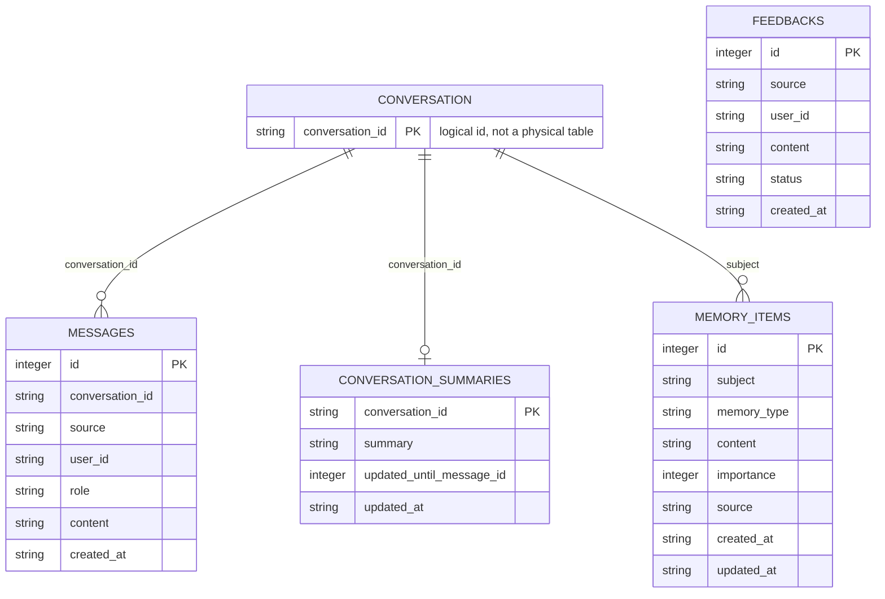

# gugabobo

`gugabobo` is a cloud-first autonomous agent prototype. The first milestone focuses on a minimal core that can run locally or on a server, keep SQLite-backed memory, expose a small API, and provide a CLI control surface. QQ and Telegram are social chat adapters over the same core identity; Telegram currently has a local webhook skeleton.

## P0 scope

- CLI entrypoint
- Core agent with shared persona
- SQLite memory and feedback store
- FastAPI health/status API
- Long-running daemon loop
- Basic tests

## Quick start

```bash
python -m venv .venv
.\.venv\Scripts\Activate.ps1
pip install -e ".[dev]"
gugabobo status
gugabobo chat "你好"
gugabobo feedback add "回复太长"
gugabobo feedback resolve 1
gugabobo messages list
gugabobo config show
gugabobo db path
gugabobo api
```

Open the local monitoring dashboard:

```text
http://127.0.0.1:8765/dashboard
```

The dashboard can also run admin-controlled actions after entering `GUGABOBO_ADMIN_TOKEN`: send a test chat message, inspect QQ/NapCat diagnostics, start/stop NapCat and Telegram polling, open NapCat WebUI, edit non-secret configuration, manage conversation context, add/filter/update/delete long-term memory, set/delete conversation summaries, update feedback status, and manage access rules. `blocked` QQ and Telegram users are ignored before reaching the core agent.

Windows launchers:

```text
scripts\start-gugabobo.bat
scripts\stop-gugabobo.bat
scripts\restart-gugabobo.bat
```

## NapCat / OneBot v11

P1 starts with a OneBot v11 HTTP webhook for NapCat.

Run gugabobo:

```bash
gugabobo api
```

Configure NapCat event reporting to:

```text
http://127.0.0.1:8765/onebot/v11/events
```

If you want gugabobo to send replies back through NapCat, enable NapCat's HTTP server and set:

```env
GUGABOBO_NAPCAT_API_URL=http://127.0.0.1:3000
GUGABOBO_NAPCAT_REPLY_ENABLED=true
GUGABOBO_NAPCAT_ACCESS_TOKEN=
```

Group chats only reply when the bot is mentioned or the message starts with a configured wake word.

## Telegram Bot

Telegram uses the same `CoreAgent`, persona, memory store, LLM provider, dashboard, and permission model as QQ.

Local webhook endpoint:

```text
http://127.0.0.1:8765/telegram/events
```

Configuration:

```env
GUGABOBO_OWNER_TELEGRAM_IDS=
GUGABOBO_TELEGRAM_BOT_TOKEN=
GUGABOBO_TELEGRAM_BOT_USERNAME=
GUGABOBO_TELEGRAM_WEBHOOK_SECRET=
GUGABOBO_TELEGRAM_REPLY_ENABLED=false
GUGABOBO_TELEGRAM_GROUP_WAKE_WORDS=gugabobo,咕嘎BoBo
```

Current behavior:

- private chats reply directly
- group chats reply only when mentioned or explicitly awakened
- each Telegram user and group keeps separate conversation context
- risky owner-only operations require explicit owner confirmation
- Telegram-specific code stays in the adapter layer, not in the core agent

When `GUGABOBO_TELEGRAM_REPLY_ENABLED=false`, the endpoint processes the message and reports that a reply is available without calling Telegram's `sendMessage` API.

For local development without a public webhook URL, run polling after setting `GUGABOBO_TELEGRAM_BOT_TOKEN`:

```bash
gugabobo telegram poll --send
```

Without `--send`, polling processes updates but only reports that replies are available unless `GUGABOBO_TELEGRAM_REPLY_ENABLED=true`.

## Kimi / Moonshot LLM

`gugabobo` supports OpenAI-compatible providers. Set `GUGABOBO_LLM_PROVIDER` to choose one.

```env
GUGABOBO_LLM_PROVIDER=moonshot
GUGABOBO_MOONSHOT_API_KEY=
GUGABOBO_MOONSHOT_BASE_URL=https://api.moonshot.ai/v1
GUGABOBO_MOONSHOT_MODEL=kimi-k2.6
GUGABOBO_DEEPSEEK_API_KEY=
GUGABOBO_DEEPSEEK_BASE_URL=https://api.deepseek.com
GUGABOBO_DEEPSEEK_MODEL=deepseek-v4-flash
GUGABOBO_LLM_TIMEOUT_SECONDS=60
GUGABOBO_LLM_CONTEXT_MESSAGES=12
```

If the API key is missing or the provider call fails, chat falls back to the local placeholder reply.

LLM context is scoped by conversation. CLI/API users, QQ private chats, and QQ groups keep separate context.

Context inputs:

- recent raw messages from the same conversation
- optional conversation summary
- relevant long-term memory items for the same conversation and global memories

Current SQLite data model:



`CONVERSATION` is a logical entity derived from `conversation_id`; it is not a separate SQLite table yet.

Useful commands:

```bash
gugabobo memory add "用户喜欢蓝色" --subject qq:user:241398668 --memory-type preference --importance 8
gugabobo memory list --subject qq:user:241398668
gugabobo summary set qq:user:241398668 "用户正在测试 QQ Bot 上下文。"
gugabobo summary show qq:user:241398668
```

When a user explicitly says `记住...`, `请记住...`, `你要记住...`, `帮我记住...`, or `remember...`, gugabobo records the content as a long-term memory for the current conversation automatically.

## Configuration

Copy `.env.example` to `.env` when you need custom local settings.
