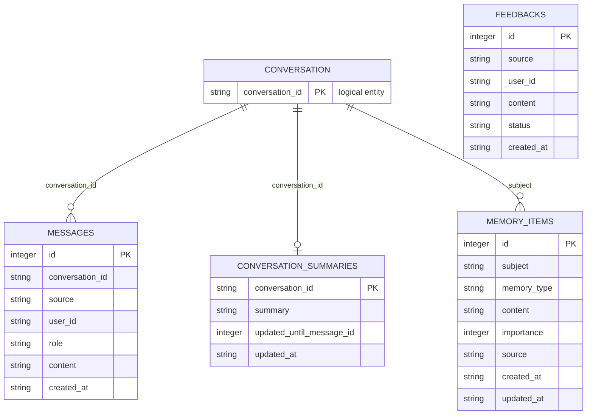
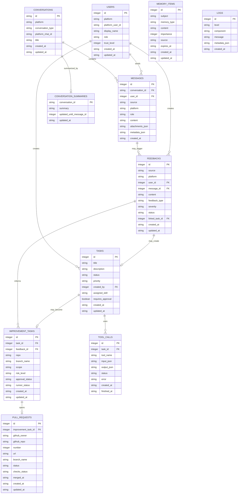

# gugabobo Technical Project Book

## 1. Executive Summary

`gugabobo` is a cloud-first, long-running autonomous agent system. It is designed around one persistent core identity, multiple interaction adapters, shared memory, explicit permission boundaries, and a controlled self-improvement workflow based on GitHub pull requests.

The system is not intended to be only a QQ bot, only a dashboard, or only a software engineering agent. Those are entry points or skills. The central product is a persistent agent body that can receive external signals, remember them, route them to specialized capabilities, and propose code changes without bypassing human review.

One-sentence definition:

```text
gugabobo is a persistent cloud-side autonomous agent that can interact across platforms, collect feedback, maintain memory, and improve its own code through sandboxed pull requests approved by its owner.
```

## 2. Product Goals

### 2.1 Primary Goals

- Keep one canonical `gugabobo` identity across CLI, QQ, Telegram, GitHub, API, dashboard, and future social platforms.
- Run continuously on a Linux server while remaining controllable from local tools.
- Persist messages, feedback, tasks, tool calls, and improvement history.
- Route user input and platform events to the correct skill.
- Provide a strict permission model for owner-only operations.
- Allow self-improvement through sandboxed code generation and GitHub pull requests.
- Keep `main` protected as the only production source line.

### 2.2 Non-Goals For Early Milestones

- Full autonomy without owner approval.
- Direct production code modification by the agent.
- Automatic merge of self-generated pull requests.
- Public social posting without confirmation.
- Complex distributed infrastructure before the core is stable.
- Premature use of vector databases, Redis, Celery, Docker Compose, or Kubernetes.

## 3. Current Repository State

Repository:

```text
https://github.com/GugaBoBo-s/gugabobo
```

Visibility:

```text
PRIVATE
```

Current milestone:

```text
P0 minimal core
```

Implemented:

- Python package under `src/gugabobo`
- CLI command entry point
- Core agent
- Persona module
- Router module
- SQLite-backed memory and feedback store
- FastAPI management API
- Minimal daemon heartbeat loop
- Tests for core and API behavior
- `AGENTS.md` and `CLAUDE.md`

Current commands:

```powershell
gugabobo status
gugabobo chat "你好"
gugabobo feedback add "回复太长"
gugabobo feedback list
gugabobo feedback resolve 1
gugabobo feedback reopen 1
gugabobo messages list
gugabobo messages show 1
gugabobo config show
gugabobo db path
gugabobo db init
gugabobo telegram poll --send
gugabobo daemon
gugabobo api
```

Current API endpoints:

```text
GET  /
GET  /health
GET  /status
GET  /dashboard
GET  /dashboard-data
GET  /logs
POST /chat
GET  /messages
GET  /messages/{message_id}
GET  /feedbacks
POST /feedbacks
PATCH /feedbacks/{feedback_id}
POST /onebot/v11/events
POST /telegram/events
GET  /docs
```

## 4. System Principles

### 4.1 One Core, Many Adapters

The system must not become several unrelated bots.

Incorrect structure:

```text
QQ Bot
X Bot
GitHub Bot
SWE Bot
```

Correct structure:

```text
QQ / Telegram / CLI / GitHub / X / Dashboard
        |
        v
gugabobo core
        |
        v
skills and tools
```

Adapters translate external events into normalized internal messages. They do not own long-term behavior, policy, memory, or persona.

### 4.2 Server Is The Body

The long-running instance lives on a Linux server.

Responsibilities:

- receive platform events
- process scheduled jobs
- call LLM providers
- record memory
- expose management API
- run worker tasks
- trigger sandboxed code modification
- submit pull requests

The local machine is the owner cockpit, not the agent body.

### 4.3 GitHub Is The Code Authority

All formal source code flows through GitHub.

```text
local development -> GitHub
server deployment <- GitHub
self-improvement -> branch -> pull request -> owner review -> merge
```

The agent must not directly modify production code or push to `main`.

### 4.4 Human Approval For Critical Actions

The owner remains the final authority for:

- merge
- production deployment
- public posting
- permission changes
- destructive data operations
- high-cost or broad code changes

## 5. High-Level Architecture

```text
Local machine
├─ CLI
├─ browser dashboard
└─ development environment

GitHub organization: GugaBoBo-s
├─ repository: gugabobo
├─ issues
├─ pull requests
├─ branch protection
└─ GitHub Actions

Linux server
├─ gugabobo daemon
├─ management API
├─ scheduler
├─ worker
├─ adapters
├─ sandbox runner
├─ SQLite/PostgreSQL
├─ logs
└─ secrets

External platforms
├─ QQ private chat
├─ QQ group chat
├─ Telegram private chat
├─ Telegram group chat
├─ GitHub events
├─ X / Twitter
└─ Xiaohongshu
```

Relationship:

```text
local = cockpit
GitHub = source authority and approval center
server = persistent body
external platforms = senses and communication channels
```

## 6. Component Architecture

### 6.1 Adapters

Adapters receive external input and emit normalized events into the core.

Required properties:

- thin
- stateless where possible
- platform-specific only at the boundary
- no direct business logic
- no direct permission bypass

Planned adapters:

```text
CLI Adapter
QQ Private Chat Adapter
QQ Group Chat Adapter
Telegram Private Chat Adapter
Telegram Group Chat Adapter
GitHub Adapter
Dashboard/API Adapter
X Adapter
Xiaohongshu Adapter
```

### 6.2 Core

Core owns the shared behavior.

Main modules:

```text
Persona
Memory
Router
Planner
Policy
Feedback
Self-Improvement
Reflection
```

### 6.3 Skills

Skills are specialized capabilities called by the core.

Initial skills:

```text
Chat Skill
Feedback Skill
Scheduler Skill
Social Writer Skill
GitHub Skill
Claude Code Runner Skill
Reflection Skill
```

### 6.4 Infrastructure

Infrastructure modules wrap storage, logs, queues, external clients, and runtime setup.

Examples:

```text
database
logging
queue
GitHub client
LLM client
settings
secrets
service lifecycle
```

## 7. Repository Structure

Current and target structure:

```text
gugabobo/
├─ AGENTS.md
├─ CLAUDE.md
├─ README.md
├─ pyproject.toml
├─ .env.example
├─ docs/
│  └─ PROJECT_BOOK.md
├─ src/
│  └─ gugabobo/
│     ├─ main.py
│     ├─ config.py
│     ├─ core/
│     │  ├─ agent.py
│     │  ├─ router.py
│     │  ├─ planner.py
│     │  ├─ policy.py
│     │  └─ persona.py
│     ├─ adapters/
│     │  ├─ cli.py
│     │  ├─ qq.py
│     │  ├─ github.py
│     │  └─ dashboard.py
│     ├─ skills/
│     │  ├─ chat.py
│     │  ├─ feedback.py
│     │  ├─ self_improvement.py
│     │  ├─ claude_code_runner.py
│     │  ├─ scheduler.py
│     │  └─ social_writer.py
│     ├─ memory/
│     │  ├─ short_term.py
│     │  ├─ long_term.py
│     │  └─ store.py
│     ├─ infra/
│     │  ├─ db.py
│     │  ├─ logs.py
│     │  ├─ queue.py
│     │  └─ github_client.py
│     └─ api/
│        └─ server.py
├─ tests/
└─ scripts/
```

## 8. Runtime Modes

### 8.1 CLI Mode

Used for local control and manual testing.

Examples:

```powershell
gugabobo status
gugabobo chat "你好"
gugabobo feedback add "回复太长"
```

### 8.2 API Mode

Used by dashboard, local tools, and future remote management clients.

Command:

```powershell
gugabobo api
```

Default address:

```text
http://127.0.0.1:8765
```

### 8.3 Daemon Mode

Used for long-running server process.

Command:

```powershell
gugabobo daemon
```

Current P0 behavior:

```text
periodic heartbeat
status read
database connectivity check through agent status
```

Target behavior:

```text
platform listener supervision
scheduler jobs
worker dispatch
feedback ingestion
health reporting
```

## 9. Data Model

### 9.1 Current Tables

Current SQLite ER diagram:



Notes:

- `CONVERSATION` is a logical entity derived from `conversation_id`; it is not a physical SQLite table yet.
- Current SQLite tables do not declare foreign keys.
- `memory_items.subject` can point to a conversation id such as `qq:user:241398668`, `telegram:user:<id>`, or the global subject `global`.
- `feedbacks` currently records source and user id only. It is intentionally not tied to a single message yet.

#### messages

Purpose:

```text
Store conversation messages from CLI/API and future platform adapters.
```

Fields:

```text
id               integer primary key
conversation_id  text
source           text
user_id          text
role             text
content          text
created_at       timestamp
```

#### feedbacks

Purpose:

```text
Store user feedback, bug reports, suggestions, behavior complaints, and improvement signals.
```

Fields:

```text
id          integer primary key
source      text
user_id     text
content     text
status      text
created_at  timestamp
```

#### conversation_summaries

Purpose:

```text
Store rolling summaries for long conversations so the LLM can keep broader context without sending every raw message.
```

Fields:

```text
conversation_id            text primary key
summary                    text
updated_until_message_id   integer
updated_at                 timestamp
```

#### memory_items

Purpose:

```text
Store explicit long-term memories for a conversation subject or for the global agent.
```

Fields:

```text
id           integer primary key
subject      text
memory_type  text
content      text
importance   integer
source       text
created_at   timestamp
updated_at   timestamp
```

### 9.2 Target Tables

Target ER diagram:



#### users

```text
id
platform
platform_user_id
display_name
role
trust_level
created_at
updated_at
```

#### messages

```text
id
conversation_id
source
platform
user_id
role
content
attachments_json
metadata_json
created_at
```

#### feedbacks

```text
id
source
platform
user_id
content
feedback_type
severity
status
proposal
linked_task_id
created_at
updated_at
```

#### tasks

```text
id
title
description
status
priority
created_by
assigned_skill
requires_approval
created_at
updated_at
```

#### improvement_tasks

```text
id
task_id
feedback_id
repo
branch_name
scope
risk_level
approval_status
runner_status
created_at
updated_at
```

#### pull_requests

```text
id
improvement_task_id
github_owner
github_repo
number
url
branch_name
status
checks_status
merged_at
created_at
updated_at
```

#### tool_calls

```text
id
task_id
tool_name
input_json
output_json
status
error
created_at
finished_at
```

#### memory_items

```text
id
memory_type
subject
content
importance
source
expires_at
created_at
updated_at
```

#### logs

```text
id
level
component
message
metadata_json
created_at
```

## 10. Message Schema

All adapters should eventually normalize platform input to this structure:

```json
{
  "source": "qq_private",
  "platform": "qq",
  "conversation_id": "qq:user:123",
  "user_id": "123",
  "display_name": "owner",
  "text": "帮我看一下状态",
  "attachments": [],
  "metadata": {
    "raw_event_id": "event-id",
    "is_group": false
  },
  "created_at": "2026-06-25T22:00:00+08:00"
}
```

The core should respond with a normalized output:

```json
{
  "text": "当前状态正常。",
  "visibility": "private",
  "actions": [],
  "metadata": {}
}
```

## 11. Router Design

Router decides which skill handles a message.

Initial routing:

```text
feedback-like text -> Feedback Skill
default text       -> Chat Skill
```

Target routing:

```text
normal conversation      -> Chat Skill
bug/suggestion/complaint -> Feedback Skill
code task                -> Self-Improvement Planner
GitHub event             -> GitHub Skill
status command           -> System Status Skill
public post request      -> Social Writer
scheduled event          -> Scheduler Skill
```

Routing output should include:

```text
skill
confidence
reason
requires_approval
risk_level
```

## 12. Policy And Permissions

### 12.1 Roles

```text
owner
trusted_operator
normal_user
guest
system
```

### 12.2 Allowed Automatically

```text
normal chat
feedback recording
feedback classification
status read
log read with safe redaction
issue creation for low-risk feedback
draft generation
test execution in sandbox
pull request creation from approved improvement tasks
```

### 12.3 Requires Owner Approval

```text
large code modification
production deployment
public social publishing
permission changes
secret changes
database deletion
external paid API usage above threshold
merge pull request
```

### 12.4 Always Forbidden

```text
push directly to main
merge own pull request
disable tests to pass CI
delete repository
leak secrets
weaken policy without approval
modify audit logs to hide actions
run unreviewed code in production directory
```

## 13. Self-Improvement Workflow

Target workflow:

```text
external feedback
  -> Feedback Agent classifies signal
  -> Self-Improvement Agent evaluates value and risk
  -> task is created
  -> owner approval if required
  -> sandbox clone is created
  -> Claude Code Runner modifies code
  -> tests/lint/type checks run
  -> branch is pushed
  -> pull request is opened
  -> GitHub Actions runs
  -> dashboard displays result
  -> owner reviews
  -> owner merges or rejects
  -> server deploys merged version
  -> Reflection Agent records outcome
```

Important invariant:

```text
gugabobo may propose surgery, but the owner approves whether it becomes real.
```

## 14. GitHub Organization Strategy

Organization:

```text
GugaBoBo-s
```

Current repository:

```text
GugaBoBo-s/gugabobo
```

Future plan:

- create a dedicated GitHub account for `gugabobo`
- invite that account into `GugaBoBo-s`
- give it limited repository write permission
- require pull requests for `main`
- require status checks before merge
- keep owner as final reviewer

Recommended branch protection:

```text
protect main
require pull request before merge
require status checks
require conversation resolution
disallow force push
disallow deletion
restrict who can push to main
```

## 15. API Design

### 15.1 Current API

#### GET /

Returns basic service information.

#### GET /health

Returns process health.

#### GET /status

Returns current agent status.

#### POST /chat

Request:

```json
{
  "message": "你好",
  "user_id": "api"
}
```

Response:

```json
{
  "reply": "我是 gugabobo，已收到：你好"
}
```

#### GET /feedbacks

Returns recent feedback records.

### 15.2 Target API

```text
GET  /health
GET  /status
GET  /messages
GET  /feedbacks
POST /feedbacks
PATCH /feedbacks/{id}
GET  /tasks
POST /tasks
POST /tasks/{id}/approve
POST /tasks/{id}/reject
GET  /improvements
POST /improvements
GET  /prs
GET  /logs
POST /service/restart
GET  /config
PATCH /config
```

## 16. CLI Design

### 16.1 Current CLI

```text
gugabobo status
gugabobo chat <message>
gugabobo feedback add <content>
gugabobo feedback list
gugabobo daemon
gugabobo api
```

### 16.2 Target CLI

```text
gugabobo status
gugabobo chat <message>
gugabobo messages list
gugabobo feedback add <content>
gugabobo feedback list
gugabobo feedback resolve <id>
gugabobo tasks list
gugabobo tasks approve <id>
gugabobo improve create <feedback-id>
gugabobo pr list
gugabobo logs tail
gugabobo config show
gugabobo api
gugabobo daemon
```

## 17. Dashboard Design

Dashboard name:

```text
gugabobo-console
```

Target pages:

```text
Overview
Server Status
Messages
Feedback Center
Tasks
Self-Improvement
Pull Requests
Test Results
Logs
Permissions
Model Configuration
Secrets Checklist
Deployment
```

Dashboard should call the server management API. It should not directly read production files or databases from the browser.

Current local dashboard:

```text
URL: http://127.0.0.1:8765/dashboard
Refresh: polls /dashboard-data every 3 seconds
Displays: status, LLM config, reply mode, conversations, recent messages, feedbacks, memories, logs
```

## 18. QQ Integration Plan

Milestone:

```text
P1
```

Recommended approach:

```text
OneBot-compatible gateway + Python adapter
```

Possible choices:

```text
NapCat
Lagrange
NoneBot with OneBot adapter
```

P1 behavior:

- private messages are handled directly
- group messages only respond when mentioned or explicitly awakened
- background feedback extraction may run without replying
- owner-only commands are rejected for non-owner users
- risky operations are blocked in group chats

Owner command examples:

```text
状态
查看反馈
记录反馈 xxx
生成改造任务
```

Group behavior:

```text
@gugabobo 你好        -> reply
gugabobo 你怎么看     -> reply if wake word enabled
普通聊天              -> do not interrupt
明显 bug 反馈          -> record silently
```

Current P1 implementation starts with NapCat HTTP integration:

```text
NapCat HTTP Client -> POST http://127.0.0.1:8765/onebot/v11/events
gugabobo -> NapCat HTTP Server /send_private_msg or /send_group_msg when replies are enabled
```

Configuration:

```text
GUGABOBO_OWNER_QQ_IDS=
GUGABOBO_NAPCAT_API_URL=http://127.0.0.1:3000
GUGABOBO_NAPCAT_ACCESS_TOKEN=
GUGABOBO_NAPCAT_REPLY_ENABLED=false
GUGABOBO_QQ_GROUP_WAKE_WORDS=gugabobo,咕嘎BoBo
```

Implemented:

```text
OneBot message event parsing
private message reply decision
group mention reply decision
group wake-word reply decision
silent group feedback recording
NapCat HTTP send client
FastAPI webhook endpoint
```

## 19. Telegram Integration Plan

Milestone:

```text
P1/P2
```

Telegram is a required social chat adapter. It must not fork the agent into a separate Telegram-only personality. The local webhook skeleton is implemented; production use still requires BotFather token setup and public webhook registration.

Target flow:

```text
Telegram Bot API webhook or polling
        |
        v
Telegram Adapter
        |
        v
normalized channel context
        |
        v
gugabobo core
```

Target behavior:

- private chats are handled directly
- group chats only respond when mentioned or explicitly awakened
- each Telegram user has isolated context
- each Telegram group has isolated group context
- owner-only operations require owner confirmation
- risky operations are blocked in group chats
- Telegram media events are normalized before reaching skills

Conversation scoping:

```text
Telegram private: telegram:user:<user_id>
Telegram group: telegram:group:<chat_id>
```

Configuration:

```text
GUGABOBO_TELEGRAM_BOT_TOKEN=
GUGABOBO_TELEGRAM_WEBHOOK_SECRET=
GUGABOBO_TELEGRAM_REPLY_ENABLED=false
GUGABOBO_TELEGRAM_GROUP_WAKE_WORDS=gugabobo,咕嘎BoBo
GUGABOBO_OWNER_TELEGRAM_IDS=
```

Implemented:

```text
Telegram webhook endpoint
Telegram message event parsing
private message reply decision
group mention/wake-word reply decision
conversation scoping
owner id mapping
Telegram sendMessage client
Telegram local polling command
webhook secret validation
adapter tests
```

Implementation notes:

- Use the same `CoreAgent`, `Persona`, memory store, LLM provider, and dashboard.
- Keep Telegram-specific parsing and sending in the adapter layer.
- Do not put Telegram permission logic directly into skills.
- Prefer webhook on server deployment; use `gugabobo telegram poll --send` for local development.

## 20. Deployment Design

### 20.1 Early Server Layout

```text
/opt/gugabobo/
├─ app/
├─ sandbox/
├─ data/
├─ logs/
├─ secrets/
└─ scripts/
```

### 20.2 Early Services

```text
gugabobo-api.service
gugabobo-daemon.service
gugabobo-worker.service
```

### 20.3 Later Infrastructure

```text
Docker Compose
PostgreSQL
Redis
Celery or RQ
Nginx
systemd timers
structured log shipping
```

## 21. Configuration

Current `.env.example`:

```text
GUGABOBO_ENV=dev
GUGABOBO_DATA_DIR=.gugabobo
GUGABOBO_DB_PATH=.gugabobo/gugabobo.db
GUGABOBO_API_HOST=127.0.0.1
GUGABOBO_API_PORT=8765
GUGABOBO_ADMIN_TOKEN=change-me
GUGABOBO_OWNER_QQ_IDS=
GUGABOBO_OWNER_TELEGRAM_IDS=
GUGABOBO_NAPCAT_API_URL=http://127.0.0.1:3000
GUGABOBO_NAPCAT_ACCESS_TOKEN=
GUGABOBO_NAPCAT_REPLY_ENABLED=false
GUGABOBO_NAPCAT_PASSIVE_REPLY_ENABLED=false
GUGABOBO_QQ_GROUP_WAKE_WORDS=gugabobo,咕嘎BoBo
GUGABOBO_TELEGRAM_BOT_TOKEN=
GUGABOBO_TELEGRAM_BOT_USERNAME=
GUGABOBO_TELEGRAM_WEBHOOK_SECRET=
GUGABOBO_TELEGRAM_REPLY_ENABLED=false
GUGABOBO_TELEGRAM_GROUP_WAKE_WORDS=gugabobo,咕嘎BoBo
```

Target configuration groups:

```text
runtime
database
api
auth
qq
telegram
github
llm
sandbox
logging
scheduler
dashboard
```

Secrets must not be committed.

Current LLM providers:

```text
provider: Moonshot / Kimi
moonshot_base_url: https://api.moonshot.ai/v1
moonshot_model: kimi-k2.6
provider: DeepSeek
deepseek_base_url: https://api.deepseek.com
deepseek_model: deepseek-v4-flash
compatibility: OpenAI-compatible Chat Completions API
fallback: local placeholder reply when key is missing or the provider fails
context: recent messages from the same conversation only
```

Conversation scoping:

```text
CLI default: cli:local
API default: api:<user_id>
QQ private: qq:user:<user_id>
QQ group: qq:group:<group_id>
Telegram private: telegram:user:<user_id>
Telegram group: telegram:group:<chat_id>
```

The LLM context has three layers:

```text
recent raw messages from the same conversation
conversation summary
long-term memory items for the same conversation and global memories
```

Different users and different groups do not share short-term context.

Manual memory and summary commands:

```text
gugabobo memory add "用户喜欢蓝色" --subject qq:user:241398668 --memory-type preference --importance 8
gugabobo memory list --subject qq:user:241398668
gugabobo summary set qq:user:241398668 "用户正在测试 QQ Bot 上下文。"
gugabobo summary show qq:user:241398668
gugabobo summary list
```

Explicit memory capture:

```text
If the user starts a message with `记住`, `请记住`, `你要记住`, `帮我记住`, or `remember`,
gugabobo stores the remaining content as a long-term memory for the current conversation.
Regular chat messages are not automatically stored as long-term memory.
```

## 22. Logging And Observability

Target log categories:

```text
system
api
adapter
router
policy
memory
tool_call
improvement
github
sandbox
security
```

Each important action should record:

```text
timestamp
component
actor
action
target
status
metadata
error if any
```

Security-sensitive logs must redact:

```text
tokens
passwords
cookies
authorization headers
private keys
LLM provider keys
```

## 23. Testing Strategy

### 23.1 Current Tests

```text
core chat records messages
feedback routing records feedback
health endpoint returns ok
chat endpoint records message
```

### 23.2 Target Test Types

```text
unit tests
API contract tests
CLI smoke tests
database migration tests
policy tests
adapter normalization tests
self-improvement sandbox tests
GitHub client tests with mocks
end-to-end local flow tests
```

### 23.3 Required Checks Before PR Merge

```text
pytest
ruff check
type check when introduced
database migration verification
security-sensitive test cases for policy changes
```

## 24. Milestone Roadmap

### P0: Minimal Core

Goal:

```text
Make gugabobo locally runnable with CLI, memory, API, and daemon heartbeat.
```

Status:

```text
mostly complete
```

Acceptance:

```text
CLI status works
CLI chat works
feedback can be recorded and listed
SQLite persists data
API health/status/chat works
daemon heartbeat works
tests pass
repo is private under organization
```

### P0.5: Core Usability

Goal:

```text
Make the current local body easier to inspect and operate.
```

Status:

```text
complete
```

Delivered:

```text
messages list command
messages show command
feedback resolve command
feedback reopen command
config show command
structured status output
file logging
basic HTML root page
database path command
database init command
```

### P1: QQ Adapter

Goal:

```text
Make gugabobo available in QQ private chats and groups.
```

Tasks:

```text
select QQ gateway
define normalized message schema
implement QQ private message adapter
implement QQ group message adapter
owner permission mapping
group mention/wake-word policy
feedback recording from QQ
tests for message normalization and policy
```

### P2: Telegram Adapter

Goal:

```text
Make gugabobo available in Telegram private chats and groups without forking the core agent.
```

Tasks:

```text
define normalized Telegram message schema
implement Telegram private message adapter
implement Telegram group message adapter
owner permission mapping
group mention/wake-word policy
Telegram webhook or local polling mode
tests for message normalization and policy
```

### P3: Dashboard And Server Management

Goal:

```text
Provide a local cockpit for status, feedback, tasks, logs, and approvals.
```

Tasks:

```text
expand FastAPI management API
create dashboard frontend
status page
feedback page
task page
log viewer
config page
admin token authentication
```

### P4: GitHub And Code Runner

Goal:

```text
Allow approved tasks to become branches and pull requests.
```

Tasks:

```text
GitHub app/token setup
issue/PR client
sandbox clone
branch creation
test runner
commit generation
PR creation
GitHub Actions status reading
```

### P5: Feedback-Driven Self-Improvement

Goal:

```text
Turn external feedback into proposed code changes.
```

Tasks:

```text
feedback classification
feedback clustering
improvement task generation
risk assessment
approval workflow
runner orchestration
reflection record
post-merge verification
```

### P6: Social Expansion

Goal:

```text
Add external social sensing and writing support.
```

Tasks:

```text
X monitoring
X draft/reply support
Xiaohongshu comment analysis
Xiaohongshu draft generation
social feedback ingestion
public posting approval
```

## 25. Risk Register

### 25.1 Platform Risk

QQ integrations may change or break.

Mitigation:

```text
isolate QQ logic in adapter
keep internal message schema stable
avoid core dependency on QQ framework
```

### 25.2 Permission Risk

An agent with write access could modify sensitive code.

Mitigation:

```text
branch-only writes
protected main
owner review
policy tests
audit logs
no automatic merge
```

### 25.3 Secret Leakage Risk

Logs, prompts, or PRs may accidentally include secrets.

Mitigation:

```text
redaction layer
secret scanning
no secrets in prompts where possible
GitHub secret scanning
review generated diffs
```

### 25.4 Scope Creep Risk

Too many adapters too early may destabilize the core.

Mitigation:

```text
finish P0/P0.5 before P1
keep milestones explicit
avoid dashboard/social/runner until needed
```

### 25.5 Cost Risk

LLM and code runner usage may become expensive.

Mitigation:

```text
approval for expensive operations
usage logs
per-day budget
model routing
dry-run mode
```

## 26. Engineering Standards

### 26.1 Coding

- Use Python 3.11 or newer.
- Keep modules small and explicit.
- Keep platform-specific logic out of core.
- Use typed public interfaces.
- Prefer structured data over string parsing.
- Keep persistence behind store/repository classes.

### 26.2 Review

- Every behavior change needs tests when practical.
- Policy changes need explicit tests.
- Adapter changes need normalization tests.
- Database changes need migration notes.
- PR descriptions should include risk and verification.

### 26.3 Operations

- Keep `.env` local.
- Keep `.env.example` updated.
- Do not commit runtime database files.
- Do not commit logs.
- Do not commit tokens.

## 27. Acceptance Checklist By Layer

### Core

```text
single persona source
stable routing interface
memory writes are durable
policy is called before risky action
tests cover routing and persistence
```

### Adapter

```text
normalizes platform event
does not own core logic
handles platform errors
records source metadata
respects group/private behavior
```

### API

```text
documented endpoints
typed request models
safe error handling
authentication for admin operations
tests for endpoint contracts
```

### Self-Improvement

```text
sandbox only
branch only
tests run before PR
PR created with clear description
owner approval required
reflection recorded after outcome
```

## 28. Immediate Next Steps

Recommended next milestone:

```text
P1 QQ integration
```

Recommended tasks:

```text
1. Select the QQ gateway.
2. Define the normalized QQ message schema.
3. Add owner permission configuration.
4. Implement private message ingestion.
5. Implement group mention and wake-word behavior.
6. Add adapter tests.
```

P0.5 is complete. Proceed to P1 QQ integration when ready.
